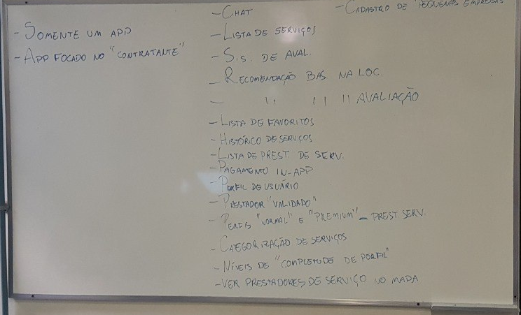

# Definição de Projeto

Este documento busca explicitar como foi o processo criativo do grupo ao longo da definição do tema escolhido para o projeto, de forma a documentar os rastros obtidos durante esse percurso.

## Histórico de Revisões

|    Data    | Versão |                      Descrição                      |   Autor(es)    |
| :--------: | :----: | :-------------------------------------------------: | :------------: |
| 22/08/2019 |  1.0   | Primeira versão do documento                        | Marcos Nery    |  

## Design Sprint

Um fato acerca da disciplina que já era conhecido por alguns membros do time é o uso de uma versão adaptada da *Design Sprint* para acelerar a fase inicial de definições do projeto, englobando a criação da ideia em sí, o fechamento de escopo, e o levantamento de requisitos acerca de tal solução computacional.

Com isso, para estender um pouco o tempo da design sprint que seria realizada e dar para a equipe mais margem para melhor desenvolver a ideia do projeto, o inicio dessa etapa se deu duas semanas antes do início do semestre, com os procedimentos descritos a seguir:

### Definição inicial da ideia 
 
Por meio da primeira reunião presencial o grupo buscou definir qual projeto seria desenvolvido. Cada membro trouxe algumas ideias e foi realizado um Brainstorm organizado para reunir todas elas, após isso, cada ideia foi discutida individualmente para levantar as opiniões de cada um acerca da realização delas. Com isso, foi montada uma tabela de pontos negativos e positivos para cada uma, que por fim foi levada em consideração para uma votação que culminou na decisão de três das ideias que seriam levadas adiante como candidatas para serem o projeto escolhido.

Também nessa reunião, foram sugeridos temas que os membros do grupo deveriam pesquisar acerca de possíveis tecnologias e métodos a serem utilizados durante a disciplina, além de quais documentos de requisitos seriam os ideias a serem desenvolvidos.

Após isso, em uma segunda reunião presencial, houve a decisão final de qual das três ideias seria a escolhida. E com isso um Brainstorm de features que poderiam estar presentes e de quais formas estas poderiam se dar, bem como alguns problemas e insights acerca da ideia, os quais o grupo deveria pensar melhor para amadurece-la. 

Também nessa reunião foi estabelecido um guideline de quais documentos de requisitos dos anteriormente selecionados provavelmente seriam os mais importantes para a ideia escolhida, incluindo um questionário que foi feito após a reunião para consultar o público alvo e sanar algumas dúvidas do grupo acerca da viabilidade da ideia, bem como levantamento inicial dos requisitos.

_Rastros: Todo os detalhes desse processo descrito podem ser lidos nos documentos produzidos: [Reunião um](https://docs.google.com/document/d/1mPdpUIUu455wS6XcJD-qGZRmkjzdTD6SiCdKyf02ESU/edit?usp=sharing), [Reunião dois](https://docs.google.com/document/d/1lbO1BRXxl-Qj22furcVBQH6wrgzwcypEwon2kQYcBuA/edit?usp=sharing), [Argumentação acerca da escolha do tema](https://drive.google.com/open?id=11979BAs72G52WG8ErNNlIMTJlolvew54)._ 

### Definições posteriores 

Com o início da disciplina e a ideia já mais amadurecida, o grupo pôde coletar também o feedback da professora e em seguida construir documentos que permitiram refinar a ideia da aplicação, tais como: 

* Análise de protocolo e entrevista, para levantamento de requisitos.
* Rich Pictures e 5W2H individuais, para uma coleta da visão de cada membro acerca da ideia.
* Briefing, para explicitar definições do contexto da ideia.
* Mapa mental, para análise de algumas tecnologias que poderiam ser utilizadas no desenvolvimento.  
* Benchmarking, para uma análise das soluções que já existiam no mercado e quais pontos positivos e negativos elas tem.
* Oceano Azul, para enxergar a aplicação em seu contexto de mercado e compara-la com seus concorrentes, procurando notar possíveis pontos onde seria possível inovar.

Todos esses documentos, assim como alguns outros abordando outros pontos, podem ser acessados por meio da barra lateral nessa Wiki.

Além disso, para facilitar o fechamento de escopo, também foi realizado um Brainstorm presencial acerca de quais seriam as features mais importantes da aplicação, as quais estariam inclusas no MVP. Primeiro, por meio do Brainstorm, foram reunidas todas as ideias de features amadurecidas até então, e logo após isso cada membro votou nas três que achava mais importantes e naquela que achava menos relevante. Os membros definidos como *Project Owners* tiveram um voto com mais peso, que são representados por formas circulares, enquanto os votos normais são representados por estrelas e as features menos relevantes pela letra "X".

#### Brainstorm com as ideias de features

#### Votação inicial 

#### Features que ficaram

