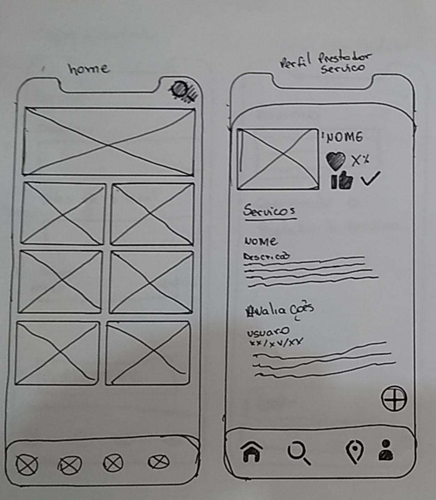

# Protótipo de Baixa Fidelidade

O **Protótipo de Baixa Fidelidade** simula algumas características do projeto, sendo que a ênfase é na funcionalidade e não na estética. Nesse tipo de modelo, geralmente, pretende-se obter um feedback de usuários que farão o teste preliminar. Ele é bastante utilizado em fases iniciais e exploratórias de um projeto para validar um conceito e decidir se uma ideia tem ou não valor funcional.

## Histórico de Revisões

|    Data    | Versão |                             Descrição                              |    Autor(es)    |
| :--------: | :----: | :----------------------------------------------------------------: | :-------------: |
| 01/09/2019 |  1.0   |       Criação do documento e adição dos primeiros artefatos        |  Kaique Borges  |
| 02/09/2019 | 1.0.1  |   Adição de telas faltantes e ajustes na formatação do documento   | Gabriel Albino  |
| 05/09/2019 | 1.0.2  |                     Adição de telas faltantes                      |  Esio Freitas   |
| 09/09/2019 |  1.1   | Condensando os protótipos em uma só imagem para compactar a página | Youssef Muhamad |
| 09/09/2019 |  1.2   |                      Adicionando referências                       | Youssef Muhamad |

### Home e perfil de usuário

#### Contato, chat e pagamento

#### Contrato, serviço e perfil user

**Autor:** [Esio Freitas](https://github.com/EsioFreitas)

### Protótipo de Criação do Prestador de Serviço

Este wireframe mostra como um usuário se transforma em um prestador de serviço. [Este Wireframe está neste Figma](https://www.figma.com/file/NXw83bhyqYSPZCbqg6uAfL/Untitled?node-id=0%3A1)

**Autor**: [Gabriel Albino](https://github.com/gabrielalbino)

### Protótipo de Layout

Baseados nos fluxos acima, algumas telas principais foram propostas para que os usuários consigam concluir seus objetivos com o app. Os wireframes são representações de baixa fidelidade das telas da aplicação, a ideia é, com o tempo, evoluí-los e aumentar a fidelidade até chegarmos num protótipo. [Este wireframe está neste Figma](https://www.figma.com/file/aHrb3wHq5lV08AnOAVGp58/Wireframes-Pax?node-id=0%3A1)

**Autor**: [Kaique Borges](https://github.com/kaiqueborges)

## Referências

- [Entrevistas](/docs/DS/dinamica-e-seminario-1/Entrevista.md)
- [Questionário](/docs/DS/dinamica-e-seminario-1/AnaliseQuestionario.md)
- [Rich Pictures](/docs/DS/dinamica-e-seminario-1/RichPicture.md)
- [Backlog](/docs/DS/dinamica-e-seminario-2/Backlog.md)
- Protótipos de baixa, média e alta fidelidade. Acessado dia **09/09/2019** em: <http://jeffersonalex.com.br/design/prototipos-de-baixa-media-e-alta-fidelidade/>
- Baixa, média ou alta fidelidade? Conheça as diferenças entre os tipos de protótipos.
  . Acessado dia **09/09/2019** em: <https://dextra.com.br/pt/baixa-media-ou-alta-fidelidade-conheca-as-diferencas-entre-os-tipos-de-prototipos/>
