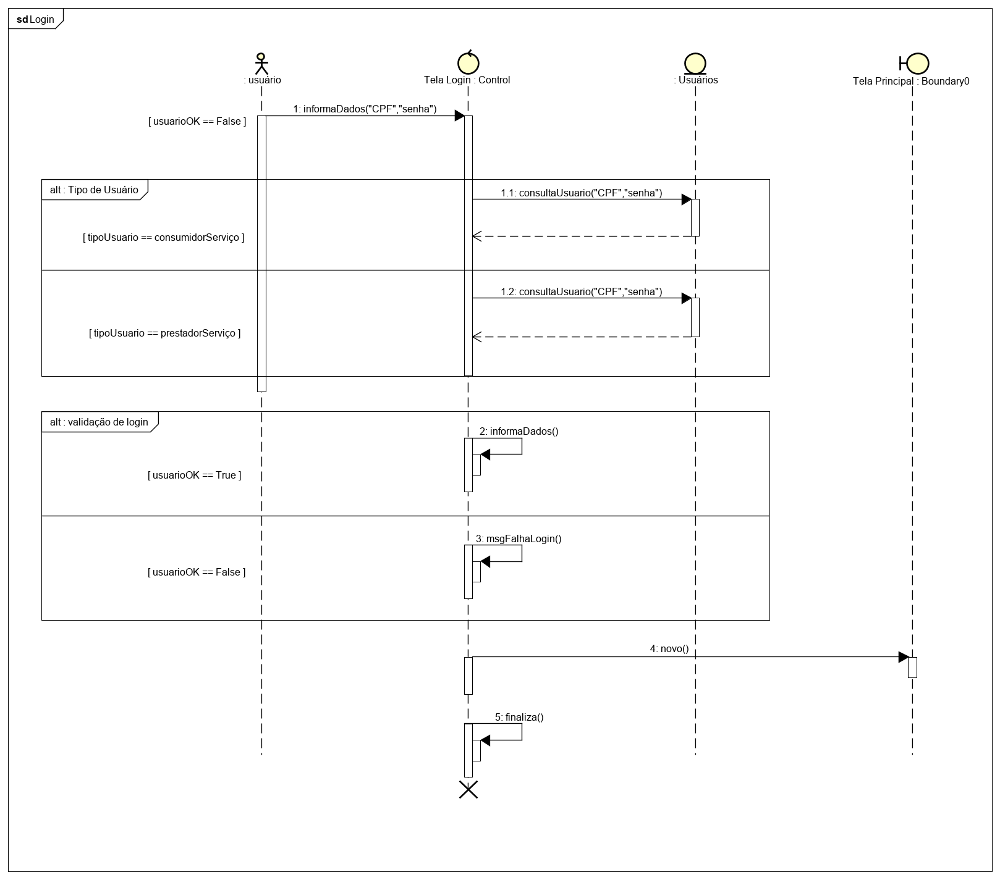

# Diagramas de Sequência

O diagrama de sequência é uma das soluções que a UML oferece, de maneira *dinâmica* para detalhar os **fluxos de vida** do sistema em desenvolvimento. O principal foco da elaboração desse diagrama é descrever sobre a interação entre componentes do sistema, processos e módulos que, de alguma maneira, vivem simultaneamente e trocam mensagens entre si. 

## Histórico de Revisões
|      Data     | Versão | Descrição                             | Autor(es) |
| :--: | :----: | :-------: | :-------: |
|   16/09/2019  | 1.0     |  Adicionando estrutura inicial e Diagrama V1 do fluxo de Login                              |       Matheus Pimenta    |
|   19/09/2019  | 2.0     |  Atualizando diagrama de Login e adicionando diagrama de Chat                             |       Matheus Pimenta    |

## Login
Detalha como funcionará o módulo de *login* do sistema, mostrando as categorias de **usuários** que uma pessoa pode representar dentro do aplicativo.

### Versão 2.0

Autor: [Matheus Figueiredo](https://github.com/Matheusss03)

### Versão 1.0

Autor: [Matheus Figueiredo](https://github.com/Matheusss03)

## Chat
Detalha como funcionará o sistema de *chat* do sistema, mostrando a relação e participação dos atores envolvidos: **Consumidor de Serviços** e **Prestador de Serviços**.

### Versão 1.0

Autor: [Matheus Figueiredo](https://github.com/Matheusss03)

## Referências

* O QUE é um diagrama de sequência UML?. [S. l.]: Lucidchart, 2019?. Disponível em: https://www.lucidchart.com/pages/pt/o-que-e-diagrama-de-sequencia-uml. Acesso em: 16 set. 2019.