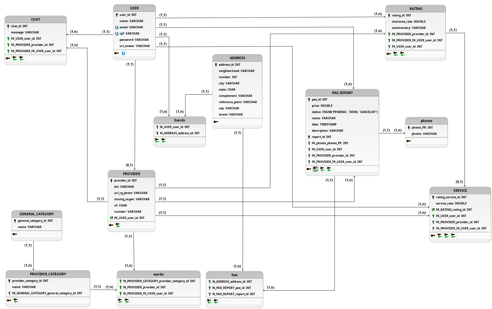

# Diagramas de Banco de Dados

Com o intuito de modelar o banco de dados, de acordo com os requisitos exigidos pelo [Backlog](docs/DS/dinamica-e-seminario-2/Backlog.md), optou-se pelo uso de três documentos que precedem a criação do banco e guiam sua correta estruturação, são eles: *Modelo Entidade-Relacionamentos* (**ME-R**) , *Diagrama Entidade-Relacionamentos* (**DE-R**) e *Diagrama Lógico* (**DL**).

O **ME-R** é um modelo conceitual utilizado na *Engenharia de Software* para descrever os objetos (entidades) envolvidos em um domínio de negócios, com suas características (atributos) e como elas se relacionam entre si (relacionamentos). Já o **DE-R** é a representação gráfica e a principal ferramenta de visualização dos relacionamentos entre as entidades do sistema. E por fim, o **DL** descreve como os dados serão armazenados no banco e também seus relacionamentos.

## Histórico de Revisões

|      Data     | Versão | Descrição                             | Autor(es) |
| :--: | :----: | :-------: | :-------: |
|   10/09/2019  | 0      |  Adicionando estrutura incial                               |       Youssef Muhamad    |
|   11/09/2019  | 0.1    |  Entidades iniciais                   |       Lucas Dutra, Youssef Muhamad e Rogério Júnior    |
|   12/09/2019  | 0.2    |  Atributos iniciais                   |        Lucas Dutra, Youssef Muhamad e Rogério Júnior    |
|   12/09/2019  | 0.3    |  Relacionamentos iniciais                                                 | Lucas Dutra, Youssef Muhamad e Rogério Júnior    |
|   14/09/2019  | 0.4    |  Melhorando a entidade ADDRESS para seguir o modelo de filtragem pelo CEP            |        Youssef Muhamad    |
|   14/09/2019  | 0.5    |  v1 dos relacionamentos                                                              |   Rogério Júnior e Youssef Muhamad |
|   15/09/2019  | 0.6    |  Corrigindo Cardinalidades e adicionando relacionamentos faltantes                   |   Rogério Júnior e Youssef Muhamad  |
|   15/09/2019  | 0.7    |  Revisão Geral e atualizações nos atributos das entidade               |   Rogério Júnior e Youssef Muhamad  |
|   15/09/2019  | 0.8    |  Adicionando DE-R e DL V1              |   Rogério Júnior e Youssef Muhamad  |
|   15/09/2019  | 0.9    |  Corrigindo leitura das cardinalidades        |   Rogério Júnior e Youssef Muhamad  |
|   15/09/2019  | 1.0    |  Adicionando descrição do documento e referências             |   Rogério Júnior e Youssef Muhamad  |

## Versão 1.0

### Modelo Entidade-Relacionamento(ME-R)

- #### Entidades:

  * USER
    * PROVIDER
  * ADDRESS
  * RATING
    * SERVICE_RATING
  * PAX
  * REPORT
  * PROVIDER_CATEGORY
  * GENERAL_CATEGORY

- #### Atributos:

  * USER ( <u>user_id</u>, name, email, cpf, password, url_avatar, id_avaliacao )
    * PROVIDER( provider_id, rg( issuing_organ, state, number ), url_rg_photo, bio )
  * ADDRESS ( <u>address_id</u>, cep, street, neighborhood, city, state, number, complement, reference_point )
  * RATING ( <u>rating_id</u>, provider_id, charisma_rate, commentary )
    * SERVICE ( <u>service_id</u>, user_id, service_rate )
  * PAX ( <u>pax_id</u>, user_id, provider_id, address_id, price, status, name, description, date )
  * REPORT ( <u>report_id</u>, user_id, pax_id, status, { photos } )
  * PROVIDER_CATEGORY ( <u>provider_category_id</u>, name )
  * GENERAL_CATEGORY ( <u>general_category_id</u>, name )
  * CHAT ( <u>chat_id</u>, user_id, provider_id ,message )

- #### Relacionamentos:

  * USER - livesIn - ADDRESS
    * Um USER pode possuir um ou vários ADDRESS(es) e um ADDRESS pode ser de um ou vários USER(s).
    * Cardinalidade: **N  : M**
  * USER - has - RATING
    * Um USER pode possuir vários RATING(s) e um RATING é de somente um USER.
    * Cardinalidade: **1 : N**
  * USER - participates - PAX
    * Um USER participa de um ou vários PAX(es) e um PAX tem a participação de somente um USER
    * Cardinalidade: **1 : N**
  * PROVIDER - participates - PAX
    * Um PROVIDER participa de um ou vários PAX(es) e um PAX tem a participação de somente um PROVIDER
    * Cardinalidade: **1 : N**
  * PROVIDER - has - RATING_SERVICE
    * Um PROVIDER pode possuir vários RATING_SERVICE(es) e um RATING_SERVICE é de um único PROVIDER.
    * Cardinalidade: **1 : N**
  * PAX - has - ADDRESS
    * Um PAX possui um único ADDRESS(es) e um ADDRESS pode ser de vários PAX(es)
    * Cardinalidade: **N : 1**
  * REPORT - reports - PAX
    * Um REPORT reporta um único PAX(es) e um PAX é reportado por um único REPORT.
    * Cardinalidade: **1  : 1**
  * PROVIDER - works - PROVIDER_CATEGORY
    * Um PROVIDER trabalha com um ou vários PROVIDER_CATEGORY(ies) e um PROVIDER_CATEGORY é trabalhado por um ou vários PROVIDER(s).
    * Cardinalidade: **N  : M**
  * GENERAL_CATEGORY - contains - PROVIDER_CATEGORY
    * Um GENERAL_CATEGORY contém um ou vários PROVIDER_CATEGORY(ies) e um PROVIDER_CATEGORY está contido em um único GENERAL_CATEGORY.
    * Cardinalidade: **1 : N**
  * USER - participates - CHAT
    * Um USER participa de um ou vários CHAT(s) e um CHAT tem a participação de somente um USER.
    * Cardinalidade: **1 : N**
  * PROVIDER - participates - CHAT
    * Um PROVIDER participa de um ou vários CHAT(s) e um CHAT tem a participação de somente um PROVIDER.
    * Cardinalidade: **1 : N**
  * PROVIDER - does - RATING
    * Um PROVIDER faz um ou vários RATING(s) e um RATING é feito por somente um PROVIDER.
    * Cardinalidade: **1 : N**
  * USER - does - RATING_SERVICE
    * Um USER faz um ou vários RATING_SERVICE(s) e um RATING_SERVICE é feito por somente um USER.
    * Cardinalidade: **1 : N**

### Diagrama Entidade-Relacionamento(DE-R)

### Diagrama Lógico (DL)

## Referências

- **Preenchimento de endereço via CEP com Javascript**. Disponível em: <https://viacep.com.br/exemplo/javascript/>. Acesso: 15 set. 2019.
- **Introdução ao Modelo de Dados e seus Níveis de Abstração**.Disponível em: <http://spaceprogrammer.com/bd/introducao-ao-modelo-de-dados-e-seus-niveis-de-abstracao/>. Acesso: 15 set. 2019.
- RODRIGUES, Joel. **Modelo Entidade Relacionamento (MER) e Diagrama Entidade-Relacionamento (DER)** Disponível em: <https://www.devmedia.com.br/modelo-entidade-relacionamento-mer-e-diagrama-entidade-relacionamento-der/14332>. Acesso: 15 set. 2019.