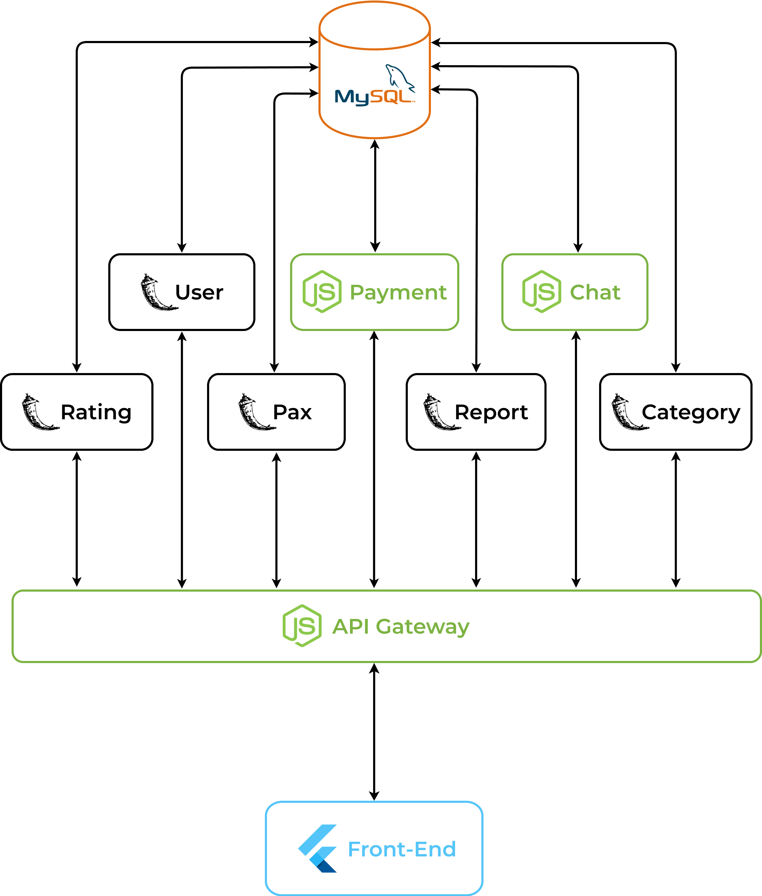
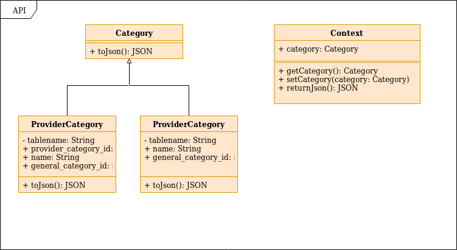
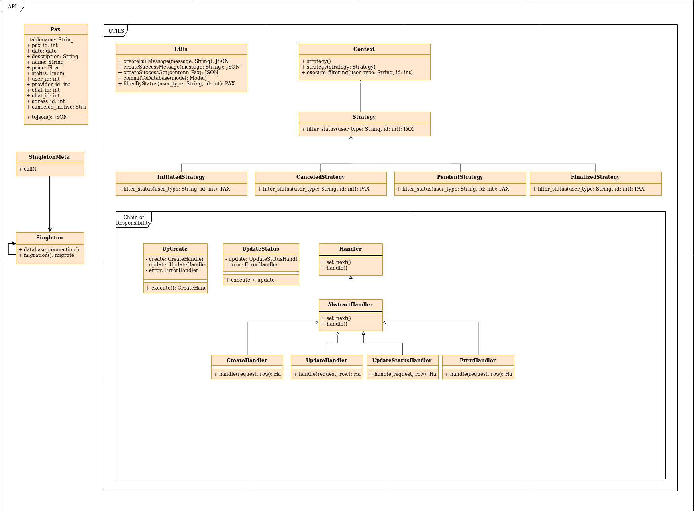

# Documento de Arquitetura de Software

|              <td colspan=2>PAX               |                                 |                |
| :------------------------------------------: | :-----------------------------: | :------------: |
|                     Nome                     |             E-mail              |     Github     |
|         Ésio Gustavo Pereira Freitas         |     esio.gustavo@gmail.com      |  @EsioFreitas  |
| Fabiana Luiza Vasconcelos Pfeilsticker Ribas |    fabianalv.ribas@gmail.com    | @FabianaRibas  |
|           Felipe Campos de Almeida           |       fepas.unb@gmail.com       |     @fepas     |
|         Gabriel Batista Albino Silva         |   enggabrielalbino@gmail.com    | @gabrielalbino |
|      Kaique Henrique de Carvalho Borges      |     rique.kaique@gmail.com      | @kaiqueborges  |
|      Lucas Dutra Ferreira do Nascimento      |       ldutra98@gmail.com        |  @lucasdutraf  |
|          Marcos Nery Borges Júnior           |    marcosnery.comp@gmail.com    |   @MarcosNBJ   |
|          Matheus Figueiredo Pimenta          |    ultra10vascaino@gmail.com    |  @Matheusss03  |
|       Rogério Silva dos Santos Júnior        |    junior.rogerio8@gmail.com    |   @rogerioo    |
|            Youssef Muhamad Jacob             | emaildeyoussefmuhamad@gmail.com |  @youssef-md   |

> Este documento tem como objetivo registrar a estrutura arquitetural do aplicativo _PAX_, desenvolvido como produto final da disciplina de ADS (Arquitetura e Desenho de Software), no campus do Gama, da Universidade de Brasília.

> O Documento de Arquitetura de Software demonstra o conjunto de visões que pretendem cobrir os aspectos técnicos e estruturais relativos ao desenvolvimento e implantação do sistema _PAX_.

## Histórico de Revisões

|    Data    | Versão |               Descrição               |    Autor(es)    |
| :--------: | :----: | :-----------------------------------: | :-------------: |
| 08/11/2019 |  1.0   |  Inicialização e estruturação do DAS  | Matheus Pimenta |
| 09/11/2019 |  1.1   | Descrição das visões presentes no DAS | Matheus Pimenta |
| 14/11/2019 |  1.2   | Inserção das descrições das visões do DAS | Matheus Pimenta |
| 17/11/2019 |  1.3   | Atualizando as visões de Caso de Uso, Implantação e Implementação | Matheus Pimenta e Marcos Nery |

## 1. Introdução

### 1.1. Finalidade

Este documento de arquitetura tem a função de especificar e documentar decisões arquiteturais relevantes na produção e implementação do projeto Pax descrevendo os aspéctos do sistema de forma clara, estruturada e objetiva.

### 1.2 Escopo

Este documento se aplica ao processo de desenvolvimento do Pax App, aplicação desenvolvida na disciplina Arquitetura e Desenho de Software, na Universidade de Brasília.

Projetos desenvolvidos mediante estruturação do _RUP_ (_Rational Unified Process_) costumam utilizar o Documento de Arquitetura de Software, dividido em visões, chamada de modelo de visualização 4+1.

Autor: [Matheus Figueiredo](https://github.com/Matheusss03)

Como mostra a imagem acima, as visão contempladas por esse modelo são:

- Visão de Casos de Uso;
- Visão Lógica;
- Visão de Implementação;
- Visão de Processo;
- Visão de Implantação;
- Visão de Dados (opcional).

A _Visão de Dados_ é uma etapa optativa introduzida posteriormente para poder aumentar a abrangência e qualidade do documento.

## 2. Representação Arquitetural

Modelo de representação dos serviços implementados e as interações estabelecidas entre esses serviços, bem como a natureza dessas interações.

### 2.1 Tecnologias

### 2.1.1 Front End

- **Flutter**

&emsp;&emsp;<i>Flutter</i> é o kit de ferramentas de interface do usuário do Google para criar aplicativos compilados nativamente para dispositivos móveis, Web e desktop a partir de uma única base de código. É um framework que possui como linguagem base o <i>Dart</i>.

&emsp;&emsp; O <i>Flutter</i> foi escolhido por ser uma técnologia em ascensão, que está se consolidando no mercado, e possui uma curva de aprendizado que se encaixava bem no escopo do projeto. A grande vantagem encontrada foi na velocidade de desenvolvimento de interfaces utilizando o <i>
Flutter</i>, que é consideravelmente maior em relação á seu principal concorrente, o <i>React Native</i>.

### 2.1.2 Back End

- **Flask**

&emsp;&emsp;<i>Flask</i> é um micro-<i>framework</i> de <i>python</i>, possui toda a flexibilidade da linguagem <i>python</i> e provê um modelo simples para desenvolvimento <i>web</i>. É baseado em 3 pilares: <i>Werkzeug</i>, uma biblioteca para desenvolvimento de <i>apps</i> WSGI, Jinja2, um <i>template engine</i> escrito em <i>Python</i> e <i>good intentions</i>, que são alta qualidade na legibilidade, liberdade de estruturar o <i>app</i> na maneira que desejar, entre outros aspectos.

&emsp;&emsp;A escolha do <i>Flask</i> deu-se principalmente a sua base na linguagem <i>Python</i>, de ampla documentação na internet, e por sua grade utilização em <i>Machine Learning</i> e <i>Data Science</i>, conceitos que podem ser aplicados no futuro em diferentes contextos das aplicação, como no sistema de recomendação. A vantagem do Flask em relação á outros <i>frameworks</i> que tem como base o <i>Python</i>, é a sua simplicidade, por se tratar de um micro-<i>framework</i>. 

- **Express**

&emsp;&emsp;O <i>Express</i> é um <i>framework</i> para aplicações web em Node.js. Pequeno e flexível, fornecendo um conjunto robusto de recursos para aplicativos web e mobile.

&emsp;&emsp;O <i>Express</i> demonstra todo o seu valor em sua escolha quando se trata de serviços de <i>real-time</i>, e também, por sua ampla comunidade que mantêm o <i>framework</i> ativamente, além de sua simplicidade.

### 2.1.2 Banco de dados

- **MySQL**

&emsp;&emsp;O <i>MySQL</i> é um sistema de gerenciamento de banco de dados, que utiliza a linguagem SQL como interface. É atualmente um dos sistemas de gerenciamento de bancos de dados mais populares da Oracle Corporation, com mais de 10 milhões de instalações pelo mundo.

&emsp;&emsp;A utilização do <i>MySQL</i> se baseou em sua robustez, por ser um dos bancos mais utilizados do mundo, e um dos mais comuns em serviços de <i>cloud</i>.

- **Firebase**

&emsp;&emsp;O Realtime Database do Firebase é um banco de dados não relacional (NoSQL) que permite a distribuição de conteúdos cross-platform.

&emsp;&emsp;O <i>Firebase</i> é uma técnologia da Google, portanto, sua integração com o Flutter é muito boa, e sua escolha foi justificada pelo uso de <i>real-time</i>, onde o firebase também se sai muito bem.

## Requisitos e Restrições Arquiteturais

### Requisitos

|   Requisitos   |                                                                            |
| :------------: | :------------------------------------------------------------------------: |
| Escalabilidade |                       A aplicação deve ser escalável                       |
|   Segurança    | A aplicação deve tratar de forma de segura os dados sensíveis dos usuários |
|    _Deploy_    |               A aplicação deve possuir _deploy_ automatizado               |

### Restrições

|  Restrições   |                                                                |
| :-----------: | :------------------------------------------------------------: |
| Conectividade |   É necessária a conexão com internet para utilização do App   |
|  Plataforma   |         A aplicação terá suporte somente para Android          |
|    Público    |  A aplicação será desenvolvida voltada ao público brasileiro   |
|   Linguagem   |      A aplicação será desenvolvida em português do Brasil      |
|    Equipe     |             A equipe possui apenas 10 integrantes              |
|     Prazo     | O escopo proposto deve ser terminado até o final da disciplina |

## 1. Visão de Casos de Uso

A _Visão de Casos de Uso_ descreve um modelo com alta significância de alto nível em relação às funcionalidades do sistema. Normalmente feito através do _Diagrama de Casos de Uso_.

### 1.1 Diagrama de Casos de Uso

O Diagrama de Casos de Uso descreve as principais funcionalidades que o sistema pretende ter. Ele é constotuído de atores, que representam os reais usuários do sistema e as funcionalidade (presentes em *balões*) do aplicativo proposto. 

Ao longo do desenvolvimento do projeto, já foram criados versões do diagrama, que pode ser visto em [Diagrama de Casos De Uso](docs/DS/dinamica-e-seminario-3/DiagramaCasosDeUso.md).

Porém, a versão mais atual pode ser vista abaixo:

**Autor:** [Marcos Nery](https://github.com/marcosnbj)

## 2. Visão Lógica

A _Visão Lógica_ mostra como está a organização conceitual do sistema em termos de **camadas**, **pacotes**, **classes** e **interfaces**.

### 2.1 Diagrama de Contexto

Focado em representar o escopo através de um diagrama de fluxo de dados de maior nível, ou seja, que consiga representar todo o sistema.

Tal diagrama já foi feito ao longo do desenvolvimento, e sua rastreabilidade pode ser vista em [Diagrama de Contexto](docs/DS/dinamica-e-seminario-3/DiagramaContexto.md).

Porém, a versão mais atualizada pode ser vista abaixo:

**Autor:** [Lucas Dutra](https://github.com/lucasdutraf) e [Youssef Muhamad](https://github.com/youssef-md).

### 2.2 Diagrama de Pacotes

## 3. Visão de Implementação

A _Visão de Implementação_ mostra como, de fato, o sistema proposto será implementado. Uma de suas principais características é a visão geral do _Diagrama de Classes_ final do projeto.

### 3.1 Diagrama de Classes

A rastreabilidade do diagrama de classe pode ser visto em [Diagrama de Classes](docs/DS/dinamica-e-seminario-3/DiagramaClasses.md).

Todos os modelos aqui disponíveis, são as versões atualizadas com a implementação dos _Design Patterns_.

#### 3.1.1 Microsserviço de Usuário

Autor: [Matheus Figueiredo](https://github.com/Matheusss03)

#### 3.1.2 Microsserviço de Categorias

Autor: [Marcos Nery](https://github.com/MarcosNBJ)

#### 3.1.3 Microsserviço PAX

Autor: [Marcos Nery](https://github.com/MarcosNBJ)

## 4. Visão de Dados (banco)

A _Visão de Dados_ mostra como está arquiteturada a camada de persistência do projeto, mapeando os objetos e os modelos de dados.

> @youssef-md e @rogerioo

## 5. Visão de Implantação

A _Visão de Implantação_ mostra como será feita a implantação dos processos e componentes para o processamento dos nós do sistema.

### 5.1 Diagrama de Implantação

O _Diagrama de Implantação_ descreve como o sistema será implantando, tendo foco a visualização dos componentes em si.

Já foi feita uma análise dessa visão ao longo do projeto, que pode ser vista em [Diagrama de Implantação](docs/DS/dinamica-e-seminario-3/DiagramaImplantacao.md).

Mas, a versão mais atualizado se encontra abaixo:

<iframe frameborder="0 " style="width:100%;height:500px;" src="https://www.draw.io/?lightbox=1&highlight=0000ff&edit=_blank&layers=1&nav=1&title=Diagrama%20de%20Implanta%C3%A7%C3%A3o#Uhttps%3A%2F%2Fdrive.google.com%2Fuc%3Fid%3D1832yt9BMR2vhcZU0Oton_NxZ7tkq957q%26export%3Ddownload"></iframe>

**Autor:** [Kaique Borges](https://github.com/kaiqueborges)

## 6. Visão de Processos

A _Visão de Processos_ mostra como será feito o modelo de projeto, tendo como base uma visualização em _sequência_.

### 6.1 Diagrama de Sequência

Autor: [Matheus Figueiredo](https://github.com/Matheusss03)

## 7. Qualidade

### 7.1 NFR (completo com marcadores)

> @youssef-md e @rogerioo

## 8. Referencial Teórico

- DONG, Tao. **Flutter**. [S. l.], 2019. Disponível em: https://medium.com/flutter. Acesso em: 15 set. 2019.
- **FLASK (FRAMEWORK WEB)**. In: WIKIPÉDIA, a enciclopédia livre. Flórida: Wikimedia Foundation, 2019. Disponível em: <https://pt.wikipedia.org/w/index.php?title=Flask_(framework_web)&oldid=55329171>. Acesso em: 15 set. 2019.
- MALLAWAARACHCHI, Vijini. **10 Common Software Architectural Patterns in a nutshell**. [S. l.], 2017. Disponível em: https://towardsdatascience.com/10-common-software-architectural-patterns-in-a-nutshell-a0b47a1e9013. Acesso em: 15 set. 2019.
- **NODE.JS**. In: WIKIPÉDIA, a enciclopédia livre. Flórida: Wikimedia Foundation, 2019. Disponível em: <https://pt.wikipedia.org/w/index.php?title=Node.js&oldid=55592828>. Acesso em: 15 set. 2019.
- PANT, Prabhu. **A complete guide to PostgreSQL**. [S. l.], 2018. Disponível em: https://medium.com/@heyPrabhu/a-complete-guide-to-postgresql-e4d1cefb9866. Acesso em: 15 set. 2019.
- RICHARDSON, Chris. **Pattern**: Decompose by subdomain. [S. l.]. Disponível em: https://microservices.io/patterns/decomposition/decompose-by-subdomain.html. Acesso em: 15 set. 2019.
- RICHARDSON, Chris. **What are microservices?**. [S. l.]. Disponível em: https://microservices.io/index.html. Acesso em: 15 set. 2019.
- WAYNER, Peter. **The top 5 software architecture patterns**: how to make the right choice. [S. l.]. Disponível em: https://techbeacon.com/app-dev-testing/top-5-software-architecture-patterns-how-make-right-choice. Acesso em: 15 set. 2019.
