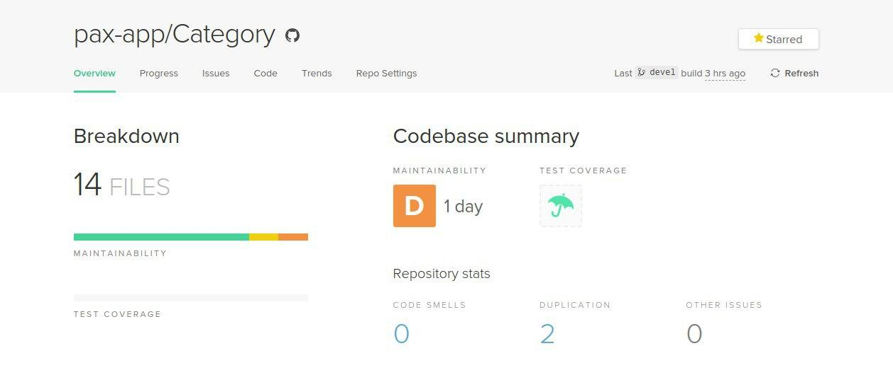

# [Category](https://github.com/pax-app/Category)

Camada da aplicação responsável pelas categorias gerais e de serviço disponíveis no sistema.

## Histórico de Revisões

|    Data    | Versão |           Descrição           |           Autor(es)           |
| :--------: | :----: | :---------------------------: | :---------------------------: |
| 25/10/2019 |  1.0   |     Criação do documento      | Fabiana Ribas e Felipe Campos |
| 13/11/2019 |  1.1   | Adição de Singleton e Factory |          Lucas Dutra          |

## Padrões usados:

### Factory method

O Application Factory, é uma evolução do design _Pattern Factory_, sendo essa evolução proposta em plataformas emergentes orientadas à convenção, e adaptada à tecnologia de Micro-framework _Flask_. Por um lado é um padrão emergente, mas por outro tem em sua base o original conceito de fábrica do padrão de projeto GoF.

Este padrão é aplicado na criação da instância de um _app_ proveniente da biblioteca padrão do _Flask_.

Arquivo: [init.py](https://github.com/pax-app/Category/blob/devel/project/__init__.py)

### [⬅](docs/DS/dinamica-e-seminario-4-b/criacionais.md#factory-method)

### Facade

O Facade é especialmente útil ao trabalhar com bibliotecas e APIs complexas.

Facade pode ser reconhecida em uma classe que possui uma interface simples, mas delega a maior parte do trabalho para outras classes. Geralmente, as fachadas gerenciam o ciclo de vida completo dos objetos que à usam.

**Arquivo:** [init.py](https://github.com/pax-app/Category/blob/devel/project/__init__.py)

**Arquivo:** [views.py](https://github.com/pax-app/Category/blob/devel/project/api/views.py)

### [⬅](docs/DS/dinamica-e-seminario-4-b/estruturais.md#facade)

### Singleton

O Singleton foi utilizado para garantirmos a instância única da aplicação com o banco de dados.

Arquivo: [database_singleton.py](https://github.com/pax-app/Category/blob/devel/database_singleton.py)

### [⬅](docs/DS/dinamica-e-seminario-4-b/criacionais.md#singleton)

### Strategy

O Strategy é um _Design Pattern_ comportamental que permite definir uma família de algoritmos, colocar cada um deles em uma classe separada e tornar seus objetos intercambiáveis.

É frequentemente usado em várias estruturas para fornecer aos usuários uma maneira de alterar o comportamento de uma classe sem estendê-lo.

O Strategy foi utilizado como forma de usar diferentes variações do método de retorno da API de acordo com cada tipo de categoria definida.

**Arquivo:** [models.py](https://github.com/pax-app/Category/blob/devel/project/api/models.py)

### [⬅](docs/DS/dinamica-e-seminario-4-b/comportamentais.md#strategy)

## Padrões não usados:

### Composite

De início, foi uma possíbilidade a utilização do _Design Pattern_ Composite, porém, sua aplicação em uma representação de árvore das categorias foi descartada por aumentar a complexidade, e o entendimento do código, por enquanto.

## Controle de Manutenabilidade

É possível ver que mesmo com a aplicação dos padrões o _Code Climate_ indica uma manutenabilidade ruim. Isso porque algumas partes específicas do código ainda estão mais complexas que o necessário, principalmente dentro de algumas estratégias do Strategy. Com isso é possível ver que mesmo tendo bons padrões de design implementados é também necessário seguir boas práticas de código dentro da implementação da resolução dos problemas do contexto em sí. Dito isso, ainda são necessárias melhorias nessa parte, para aplicar bons design patterns em um bom código e conseguir atingir boas métricas.

Este resultado leva em conta fatores como:

- Quantidade de argumentos de uma função
- Complexidade lógica
- Tamanho do arquivo
- Replicação de código
- Complexidade de métodos
- Quantidade de métodos
- Tamanho dos métodos
- Estruturas com muitos _if_ e _switch_
- Retorno dos métodos
