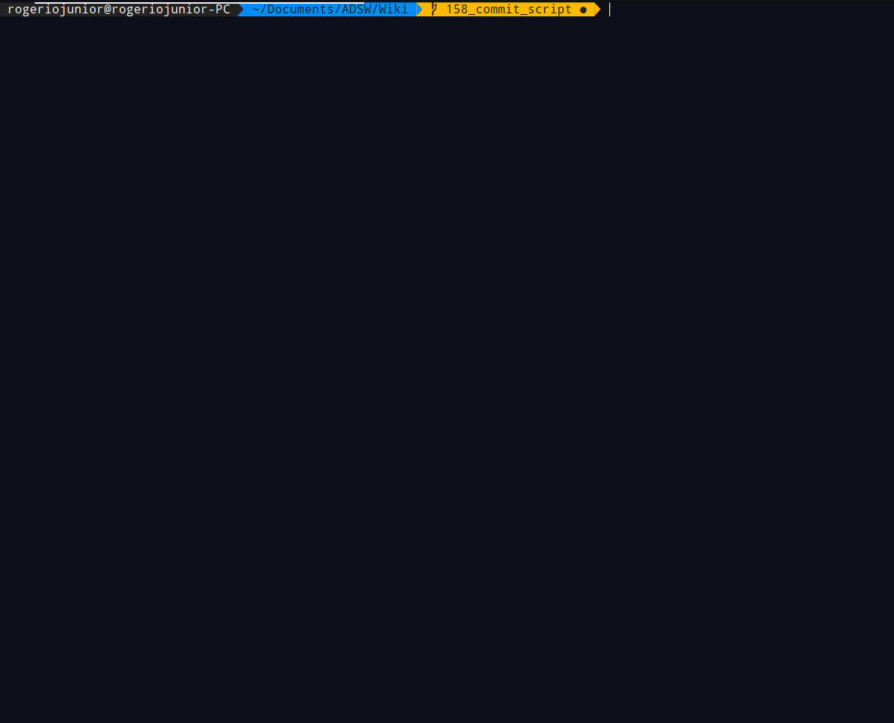

# Guia de Contribuição  

## Como contribuir?

Para contribuir com o projeto é muito fácil e cada pouquinho conta! Basta seguir os seguintes passos:

* *Fork* do repositório (apenas para usuários externos)
* Criar [*issues*](CONTRIBUTING.md#política-de-issues)
* Criar [*branchs*](CONTRIBUTING.md#política-de-branches)
* Seguir a política de [*commits*](CONTRIBUTING.md#política-de-commits)
* Submeter [*Pull Request*](CONTRIBUTING.md#política-de-merges-e-pull-requests)


### Política de Issues

As *issues* devem possuir título, descrição, no mínimo um assinante responsável, *labels*,  *milestone*(a *sprint* que deve ser concluída).

Para criação de issue o [template Issue](.github/issue_template.md) deve ser seguido.

### Política de Branches  

#### *master*

A branch *master* é a branch de produção, onde ficará a versão estável do projeto. Ela estará bloqueada para commits e para pushs. As alterações serão disponibilizadas a medida que os critérios necessários para a nova versão estável estiverem concluídos. 

#### *development*

A branch *development* é a branch de desenvolvimento, onde o trabalho das outras branchs será unificado e onde será criada uma versão estável para mesclar com a *master*.

Assim como a *master* ela está bloqueada para commits e pushs.

Para adicionar novas alterações estáveis é necessário abrir um *pull request*, seguindo o [modelo padrão](.github/pull_request_template.md), que deve ser submetido, obrigatoriamente, a algum gerente, *PO* ou *SM*, que revisará e avaliará se as modificações podem ser agregadas ao projeto.

#### Nome das Branches  

As branchs de desenvolvimento de features serão criadas a partir da branch *development* com a nomenclatura padrão da lingua inglesa `x_issue_name`, onde o `x` representa o código de rastreio da issue.

### Política de Commits

Os commits devem ser feitos usando o *script* [*paxmmit*](https://github.com/pax-app/Wiki/blob/master/paxmmit) disponibilizado na pasta raiz do repositório da *Wiki*.

Para disponibilizá-lo como um commando nativo do terminal basta seguir os seguintes passos:

```bash
cd ~
```

```bash
mkdir bin
```

!> Para o próximo commando é necessário que o [*paxmmit*](https://github.com/pax-app/Wiki/blob/master/paxmmit) esteja dentro deste diretório.

```bash 
chmod u+x paxmmit
```

Agora abra o seu *bashrc / zshrc* é adicione a seguinte linha de comando ao arquivo:

```bash 
nano ~/zshrc
```

```bash 
export PATH=$PATH:~/bin
```

Basta instalar seu arquivo *bashrc*/*zshrc* com as novas modificações:

```bash 
source ~/zshrc
```

Para executar o commando de *commit* use o comando abaixo seguinte o passo-a-passo do que o *script* pede

```bash 
paxmmit
```

O *paxmmit* possui uma comunicação bem simples e direta: basta inserir a mensagem do *commit*, dizer se o commit é em pareamento ou não (ele já possui a linha de co-authored para todos os membros da organização com seus devidos **apelidos minúsculos**) e ele vai te mostrar a mensagem formatada, caso esteja correta, basta confirmar que ele faz o *commit*. Segue um exemplo a baixo:



### Política de Merges e Pull Requests

#### Pull Requests

Pull requests devem ser feitos para a branch *master* seguindo as regras e os passos do tópico [*Merges para master*](CONTRIBUTING.md#merges-para-master). No conteúdo do pull request deve haver uma descrição clara do que foi feito.

Deve ser seguido o [template *pull request*](.github/pull_request_template.md).

#### Merges para *master*
Os merges para *master* deverão ser feitos quando a funcionalidade ou refatoração estiverem de acordo com os seguintes aspectos:  

- Funcionalidade ou refatoração concluída;
- Funcionalidade revisada por algum outro membro.

Para fazer um merge para *master* os passos a serem seguidos são:  
- `git checkout branch_de_trabalho`;
- `git pull --rebase origin master`;
- `git push origin branch_de_trabalho`;
- Abrir pull request via interface GitHub;
- Aguardar Code Review


##### Code Review
O code review deve ser feito por um ou mais membros da equipe que não participaram das modificações.
Após pelo menos uma aprovação de Code Review,Pull Request poderá ser aceito;

Para aceitar o Pull Request, deve-se usar a opção *merge* no Github.