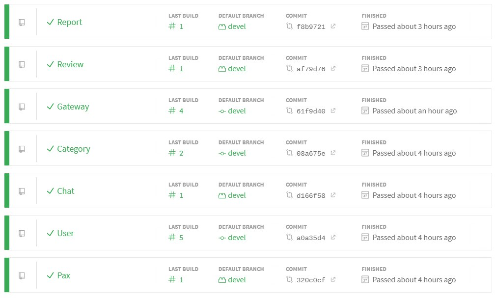
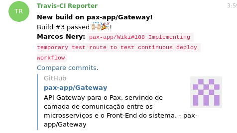

# Deploy contínuo e monitoramento 

Para tornar o trabalho de desenvolvimento e evolução do aplicativo mais ágil foi construída por meio Travis uma pipeline automatizada de deploy para o nosso ambiente de produção no heroku. Dessa forma, todo commit chega a branch estável de qualquer um dos repositórios dos nossos microsserviços são automaticamente colocados em produção, de tal forma que ficam acessíveis nas nossas URLs do Heroku pouco após o commit ter sido enviado ao GitHub.  

Esse deploy, cujos passos são estabelecidos a partir do [.travis.yml](https://github.com/pax-app/User/blob/devel/.travis.yml) de cada repositório, foi feito utilizando Docker containers. Isso garante a equidade entre o ambiente visto em produção e o utilizado em desenvolvimento, facilitando a resolução de erros e manutenção de um código sempre funcional rodando, já que o visto localmente deverá ser na maioria das vezes igual o visto no Heroku.

Além disso, o travis também proporciona excelentes ferramentas de monitoramento, que nos permitem verificar se as builds feitas no Deploy estão sendo executadas com sucesso ou se há algum erro.

Também foram configuradas integrações com o Travis para checarem as builds de Pull Requests feitos para as branchs estáveis nos repositórios do GitHub e para notificar acerca das builds enviadas para deploy em nosso grupo no Telegram, tudo em busca de prover para o time um desenvolvimento um rápido e fácil monitoramento da pipeline da aplicação.

Por fim, para os serviços da Gateway e do Chat, que pelo modo como funcional estão mais sujeitos a erros e podem comprometer outras partes do sistema caso parem de funcionar, também foi configurada integração com o [Sentry Dsn](https://blog.sentry.io/2018/03/06/the-sentry-workflow). Esse serviço monitora o backend rodando em produção e notifica a equipe de desenvolvimento através dos nossos canais de comunicação quando ocorre algum erro após um endpoint ser acessado. Com esse complemento temos não apenas o monitoramento de todo o pipeline de deploy da aplicação mas também do código atualmente em curso.

